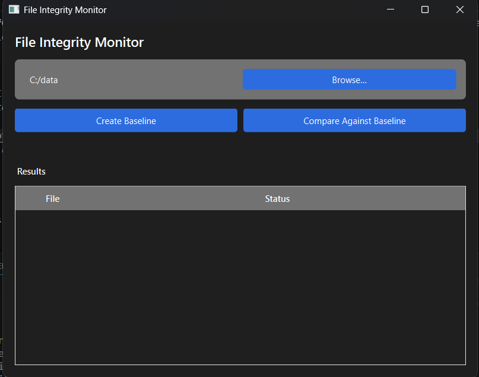
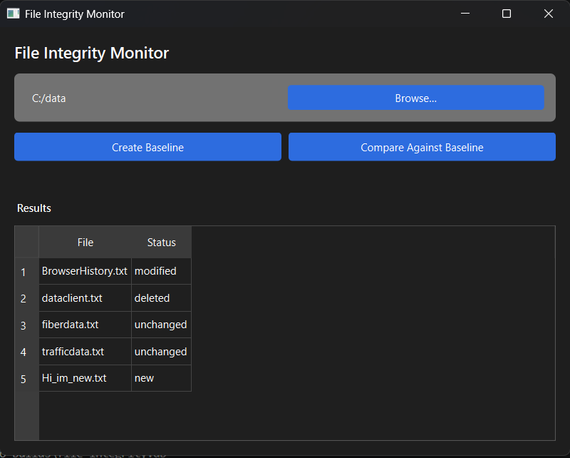

# FileWatchdog (File Integrity Monitoring Tool - C++)

## Overview

FileWatchdog is a C++ file integrity monitoring tool with both a command-line interface and a Qt6 desktop GUI. It scans directories, hashes every file, and lets you save that snapshot as a named baseline — then later compare the current state of the folder against that baseline to see exactly what's new, modified, or deleted.

This project started as a console prototype and has since grown into a full CLI + GUI application, built as part of my learning path toward cybersecurity-focused desktop tooling in C++ and Qt.

---

## Purpose

The goal is to demonstrate the core idea behind file integrity monitoring systems used in cybersecurity:

- Maintain a trusted baseline of file states (hash, size, last modified)
- Detect files that have been modified since the baseline was taken
- Detect files that are new
- Detect files that have been deleted

---

## Features

- Recursive directory scanning using `std::filesystem`
- SHA-256 hashing of every file for cryptographic verification
- Automatic exclusion of noise folders during scans (`.git`, `build`, `.vs`, `.vscode`, `node_modules`)
- Symlink-safe and fault-tolerant scanning (an unreadable file is skipped and logged, not fatal)
- SQLite-backed baseline storage — durable, queryable, no manual file management
- One baseline per monitored folder — no naming, no typos, Create and Compare always agree
- Change detection engine that classifies every file as unchanged, modified, new, or deleted
- Two interfaces sharing the exact same underlying scan/compare/storage logic:
  - **Command-line interface** — `create`, `compare`, `help`
  - **Qt6 desktop GUI** — folder picker, one-click baseline creation, and a color-coded results table

---

## Technologies Used

- **Language**: C++17
- **Build System**: CMake 3.16+
- **GUI Framework**: Qt6 (Widgets)
- **Standard Library**: `filesystem`, `chrono`, `vector`, `iostream`, `fstream`, `unordered_map`
- **Cryptography**: picosha2 (SHA-256 hashing)
- **Storage**: SQLite3
- **Compiler**: MinGW-w64 (GCC 13.1.0) — MSVC/GCC on other platforms should also work with minor adjustment

---

## Architecture

The project is split so that the CLI and GUI share one codebase for all real logic:

```
core.h / core.cpp         → scanning, hashing, comparing, baseline persistence
                             (no I/O, no UI — pure logic, reusable everywhere)
database.h / database.cpp → SQLite wrapper (baselines + baseline_files tables)
main.cpp                  → CLI entry point (create / compare / help)
gui_main.cpp,
mainwindow.h/.cpp/.ui      → Qt6 GUI entry point and window
```

`CMakeLists.txt` builds a shared static library, `FileIntegrityCore`, containing all the core logic — both `FileIntegrityMonitor.exe` (CLI) and `FileIntegrityMonitorGui.exe` (GUI) link against it. Any fix or feature added to the core logic benefits both interfaces automatically, with zero duplication.

---

## Key Concepts Practiced

- File system traversal with recursive directory iteration
- Cryptographic hashing for integrity verification
- Comparison algorithms and change detection logic
- Type-safe status representation using `enum class`
- Clean separation of logic, persistence, and UI layers (shared core library linked into two separate executables)
- SQLite integration via the C API
- Qt6 Widgets: signals/slots, `QTableWidget`, `QFileDialog`, `QInputDialog`
- CMake multi-target project configuration
- Cross-platform text-encoding pitfalls (locale-dependent `fs::path` conversion on Windows/MinGW, fixed via UTF-8-explicit conversions)
- Debugging and toolchain setup: CMake generators, MinGW/gdb integration with VS Code, IntelliSense configuration via `compile_commands.json`

---

## How to Build & Run

### Requirements
- C++17-capable compiler (MinGW-w64/GCC recommended; MSVC should also work)
- CMake 3.16+
- Qt6 (Widgets module) — required only for the GUI target

### Build
```bash
cmake -B build -S . -DCMAKE_BUILD_TYPE=Debug -DCMAKE_PREFIX_PATH="/path/to/Qt6/mingw_64"
cmake --build build
```

### Run — CLI
```bash
build/FileIntegrityMonitor.exe help
build/FileIntegrityMonitor.exe create "C:/path/to/folder" my_baseline
build/FileIntegrityMonitor.exe compare "C:/path/to/folder" my_baseline
```

### Run — GUI
```bash
build/FileIntegrityMonitorGui.exe
```
Browse to a folder, click **Create Baseline**, make some changes, then click **Compare Against Baseline** to see the results table (new, modified, deleted, unchanged).

### Screenshots


*Main window — folder selected, ready to create or compare a baseline.*


*Compare results table with New/Modified/Deleted/Unchanged rows.*

### Example CLI Output
```bash
Scanned files:
docs/readme.txt | 1200 bytes
docs/guide.txt | 850 bytes
Total files scanned: 2

Compared against baseline: my_baseline
docs/readme.txt -> unchanged
docs/guide.txt -> modified
docs/newfile.txt -> new
docs/oldfile.txt -> deleted
Summary: unchanged=1, modified=1, new=1, deleted=1 
```
---

## Project Status

Core logic, CLI, and GUI are all complete and working:

- Scanning, hashing, and SQLite-backed baseline persistence
- Full change detection and classification, exposed identically through both the CLI and GUI
- One baseline per folder, managed automatically — no manual naming required
- Noise-folder exclusion and fault-tolerant scanning
- a progress indicator during large scans (the scanning function already supports an optional progress callback)

**Possible future extensions**: CSV/JSON export of results, and a view for browsing/managing multiple saved baselines.

**Core principle**: The scanning and comparison logic remains completely independent of persistence and UI — the CLI and GUI are two thin front-ends over one shared, tested core.

---

### Author

- Tobit Vervat